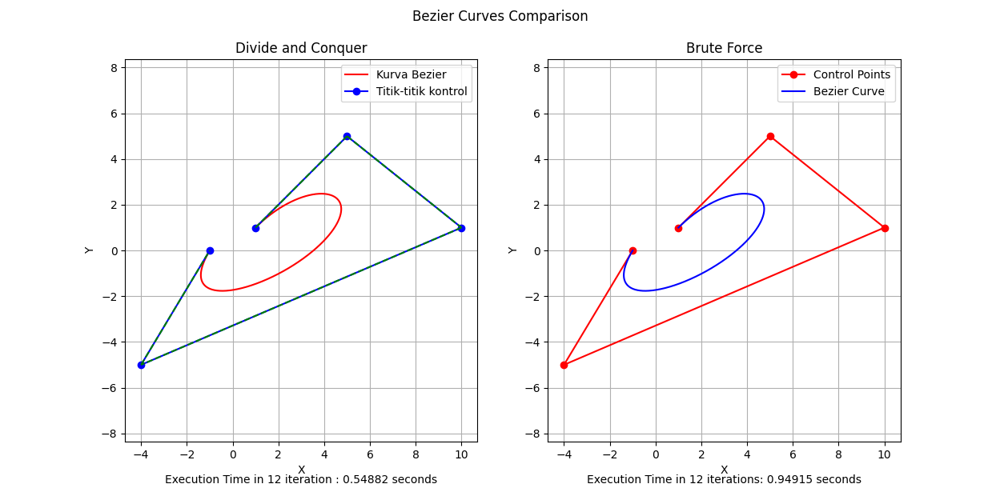
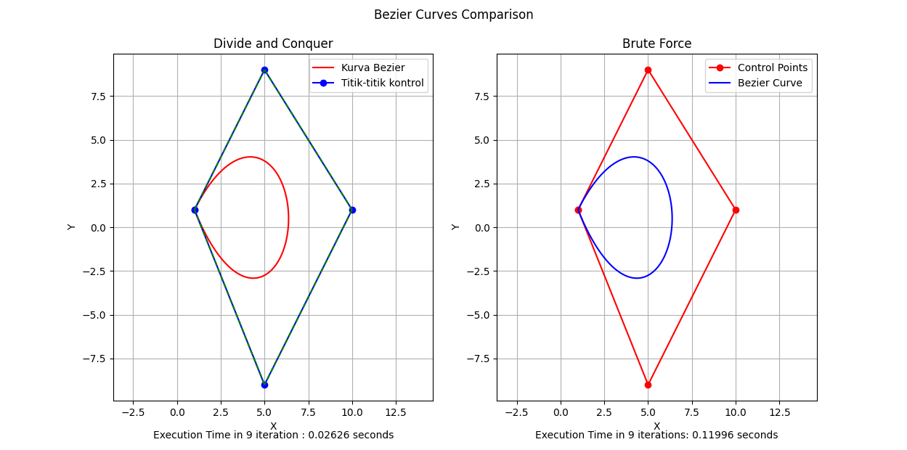
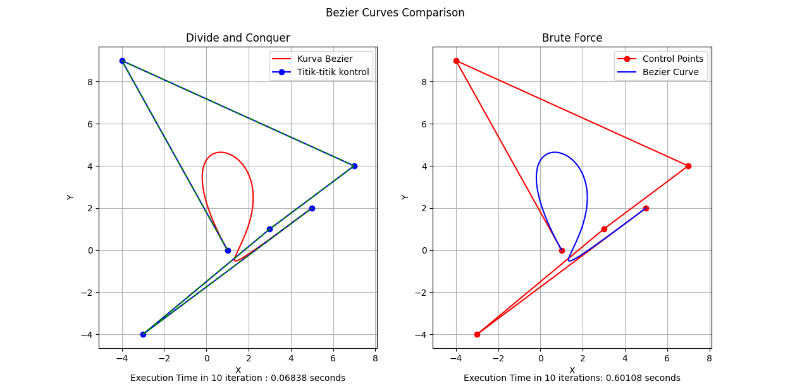

# Tugas Kecil 2 IF2211 Strategi Algoritma
Making Bezier Curve using Divide And Conquer & Brute Force Algorithm
Made by :   
| Name                | NIM |
|---------------------|------------|
| Hugo Sabam Augusto  | 13522129   |
| Muhammad Dzaki Arta | 13522149   |

## Tech

**Language:** Python\
**Modules:** Matplotlib , Numpy  

## Installation

1. Clone this repository
2. Change directory to bin : `cd bin`
3. In folder `bin` , type `python main.py` in the terminal to run the program

## Snapshot Program

